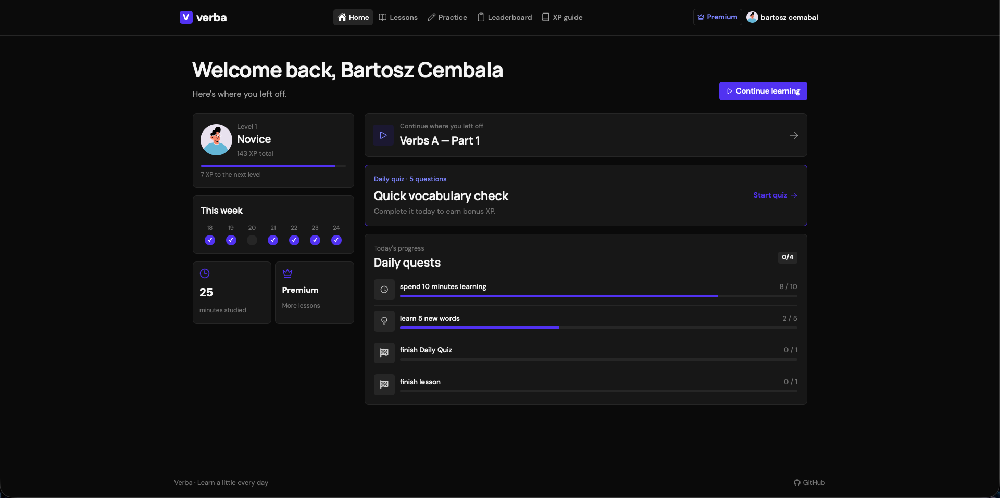

<div align="center">

# Verba

[](https://nodejs.org/)
[](https://www.typescriptlang.org/)
[](https://react.dev/)
[](https://nestjs.com/)
[](https://www.postgresql.org/)

A full-stack Spanish learning application built around structured lessons, focused practice, daily consistency, and measurable progression.

[Live application](https://verba-ebon.vercel.app) · [Features](#features) · [Development setup](#development-setup) · [Report an issue](https://github.com/bartoszcembala/Verba/issues)

</div>



## Table of contents

- [Features](#features)
- [Overview](#overview)
  - [Applications](#applications)
  - [Architecture](#architecture)
- [Technology](#technology)
- [Development setup](#development-setup)
  - [Prerequisites](#prerequisites)
  - [Automatic setup](#automatic-setup)
  - [Local addresses](#local-addresses)
  - [Manual commands](#manual-commands)
- [Environment variables](#environment-variables)
- [Database](#database)
- [Authentication and administration](#authentication-and-administration)
- [Stripe webhooks](#stripe-webhooks)
- [Testing](#testing)
- [Deployment](#deployment)
- [Contributing](#contributing)

## Features

### Learning experience

- **Structured lessons:** Spanish learning content organized by topic and difficulty level.
- **Vocabulary modules:** Focused word collections with individual learning progress.
- **Practice sessions:** Translation and AI-generated fill-in-the-blank exercises with typing and multiple-choice modes.
- **Daily quiz:** A repeatable daily challenge backed by server-side answer validation.
- **Responsive interface:** A focused Tailwind CSS interface with mobile navigation and dark mode.

### Progression and engagement

- **XP and levels:** Centralized backend progression rules prevent duplicate rewards.
- **Daily quests:** Dated quest progress is tracked independently for every learner.
- **Learning streaks:** Daily activity contributes to a persistent study streak.
- **Study-time tracking:** Time spent learning is recorded and displayed in account statistics.
- **Leaderboard:** Learners can compare XP and open public profiles.

### Platform capabilities

- **Secure authentication:** JWT sessions are stored in HTTP-only cookies.
- **Role-based administration:** Only administrators can create, edit, or delete modules and lessons.
- **Protected application routes:** Account, learning, exercise, premium, and dashboard routes enforce access rules.
- **Premium checkout:** Stripe Checkout is synchronized through signed webhooks.
- **Request protection:** Login and signup endpoints are rate-limited per client IP.

## Overview

### Applications

- **frontend:** A React and Vite single-page application deployed on Vercel.
- **backend:** A modular NestJS REST API deployed on Render.
- **postgres:** PostgreSQL persistence managed through Drizzle ORM migrations.

### Architecture

```text
Verba
├── frontend/
│   ├── src/components/       Shared UI and exercise session components
│   ├── src/lib/queries/      TanStack Query API integrations
│   ├── src/pages/            Application routes and page layouts
│   └── vercel.json           SPA routing and same-origin API proxy
├── backend/
│   ├── src/<domain>/         NestJS controller, service, repository, and module
│   ├── src/common/           Authentication, validation, and HTTP helpers
│   ├── src/storage/schema/   Drizzle PostgreSQL schema
│   ├── src/database/         Generated SQL migrations
│   └── test/                 Authentication and progression E2E coverage
└── setup.sh                  Complete local environment setup
```

The browser calls `/api` on the frontend origin. In production, Vercel proxies those requests to the NestJS service on Render. The API owns authentication, progression rules, content management, payments, and all PostgreSQL writes.

## Technology

| Layer | Technologies |
| --- | --- |
| Frontend | React, TypeScript, Vite, Tailwind CSS, TanStack Query, React Router, Recharts |
| Backend | NestJS, TypeScript, Drizzle ORM, PostgreSQL |
| Authentication | JWT, HTTP-only cookies, role guards, endpoint rate limiting |
| Integrations | OpenAI exercise generation, Stripe Checkout and webhooks |
| Development | npm, Docker Compose, ESLint, Node.js test runner |
| Hosting | Vercel, Render, Render PostgreSQL |

## Development setup

### Prerequisites

- Node.js 20 or newer
- npm
- Docker with Docker Compose
- OpenSSL

### Automatic setup

From the repository root, run:

```bash
./setup.sh
```

The setup script:

1. Checks the required tools and Node.js version.
2. Creates missing environment files without replacing existing ones.
3. Generates a local JWT secret.
4. Installs locked frontend and backend dependencies.
5. Starts the PostgreSQL Docker container.
6. Applies all Drizzle migrations.
7. Type-checks and builds both applications.
8. Starts the frontend and backend development servers.

Press `Ctrl+C` to stop both application processes. The PostgreSQL container and its named data volume are preserved.

### Local addresses

| Service | Address |
| --- | --- |
| Frontend | `http://localhost:5173` |
| Backend API | `http://localhost:5001/api` |
| Health endpoint | `http://localhost:5001/api/health` |
| PostgreSQL | `localhost:5433` |

### Manual commands

Run the applications independently when the initial setup has already completed:

```bash
cd backend
npm run start:dev
```

```bash
cd frontend
npm run dev
```

Useful quality commands:

```bash
cd backend
npm run typecheck
npm run build
```

```bash
cd frontend
npm run typecheck
npm run lint
npm run build
```

## Environment variables

Copy the committed examples when configuring the applications manually:

```bash
cp backend/.env.example backend/.env
cp frontend/.env.example frontend/.env.development
```

Important backend variables:

| Variable | Purpose |
| --- | --- |
| `DATABASE_URL` | PostgreSQL connection string used by the API and Drizzle |
| `JWT_SECRET` | Secret used to sign authentication cookies |
| `JWT_EXPIRES_IN` | JWT lifetime, such as `90d` |
| `COOKIE_SECURE` | Enables secure cross-site cookie settings in production |
| `FRONTEND_URL` | Allowed frontend origin for CORS |
| `AUTH_RATE_LIMIT_MAX` | Maximum login or signup attempts per window |
| `AUTH_RATE_LIMIT_WINDOW_MS` | Authentication rate-limit window in milliseconds |
| `OPENAI_API_KEY` | Enables AI-generated fill-in-the-blank exercises |
| `OPENAI_MODEL` | OpenAI model used for exercise generation |
| `STRIPE_SECRET_KEY` | Stripe server API key |
| `STRIPE_WEBHOOK_SECRET` | Secret used to verify Stripe webhook signatures |

The frontend uses `VITE_API_URL`. Local development points it at `http://localhost:5001/api`; production uses `/api` through the Vercel proxy.

Never commit populated `.env` files or production credentials.

## Database

PostgreSQL runs locally in Docker on port `5433`. Schema changes are managed through generated Drizzle migrations:

```bash
cd backend
npm run db:generate
npm run db:migrate
```

Additional local development commands:

```bash
npm run db:push
npm run db:studio
```

Use migrations for deployed databases. `db:push` is intended for local development and should not replace production migrations.

Daily quest definitions live in backend source code. PostgreSQL stores only dated, user-specific quest progress. The repository does not currently include a production content seed script.

## Authentication and administration

New accounts receive the `user` role. Promote an existing account from the backend directory after migrations have been applied:

```bash
npm run user:promote -- admin@example.com
```

Administrators can create, update, and delete learning modules and lessons. Reading learning content remains public, while account data, progression commands, exercises, and premium operations require authentication.

## Stripe webhooks

Set `STRIPE_SECRET_KEY` and `STRIPE_WEBHOOK_SECRET` in `backend/.env`. Configure Stripe to deliver these events:

- `checkout.session.completed`
- `checkout.session.async_payment_succeeded`

Production endpoint:

```text
https://your-api-domain/api/checkout/webhook
```

For local development, forward Stripe events directly to the backend:

```bash
stripe listen --forward-to localhost:5001/api/checkout/webhook
```

Copy the generated `whsec_...` value into `STRIPE_WEBHOOK_SECRET`.

## Testing

Run the backend authentication and progression E2E suite:

```bash
cd backend
npm run test:e2e
```

The runner starts an isolated PostgreSQL container on an automatically assigned port, applies migrations, executes the suite, and stops the test database. Set `TEST_DATABASE_URL` only when using a dedicated external test database.

## Deployment

### Frontend — Vercel

Configure the Vercel project with `frontend` as its root directory:

```text
Build command: npm run build
Output directory: dist
VITE_API_URL: /api
```

`frontend/vercel.json` provides the `/api` reverse proxy and the SPA fallback required for direct React Router navigation.

### Backend — Render

Configure the Render web service with `backend` as its root directory:

```text
Build command: npm ci && npm run build
Start command: npm run db:migrate && npm start
Health check: /api/health
```

Set `DATABASE_URL` to the Render PostgreSQL internal database URL. Configure the remaining production backend variables from `backend/.env.example`, using real secrets and `COOKIE_SECURE=true`.

For paid Render services, migrations can instead run as a pre-deploy command before `npm start`.

## Contributing

1. Create a feature branch.
2. Keep changes focused and use conventional commits.
3. Run the relevant type-check, build, lint, and E2E commands.
4. Open a pull request describing the behavior and verification performed.

Example commit:

```text
feat(exercises): add a new practice mode
```
